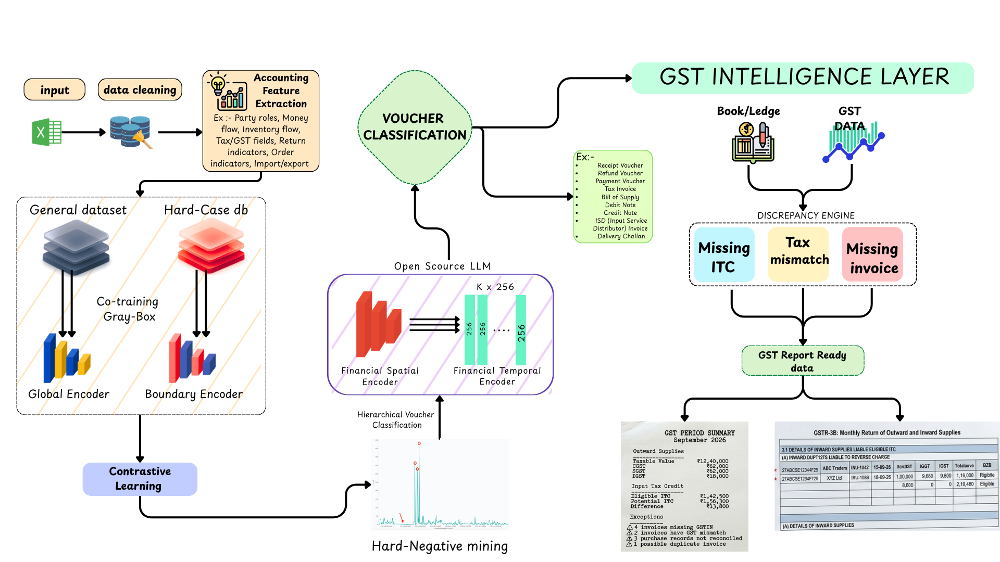
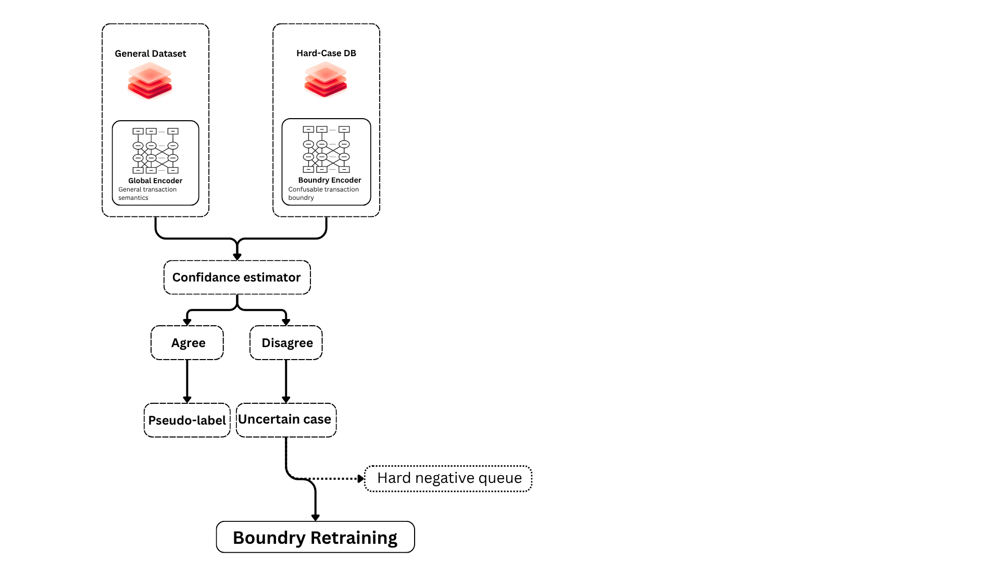
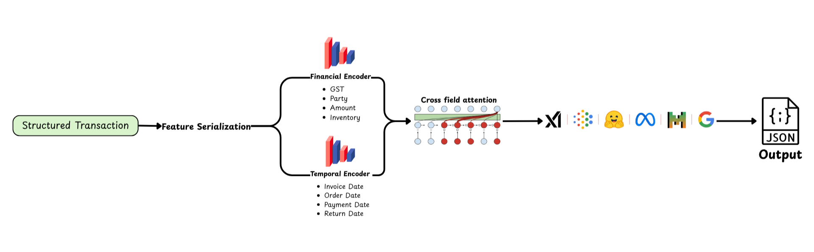
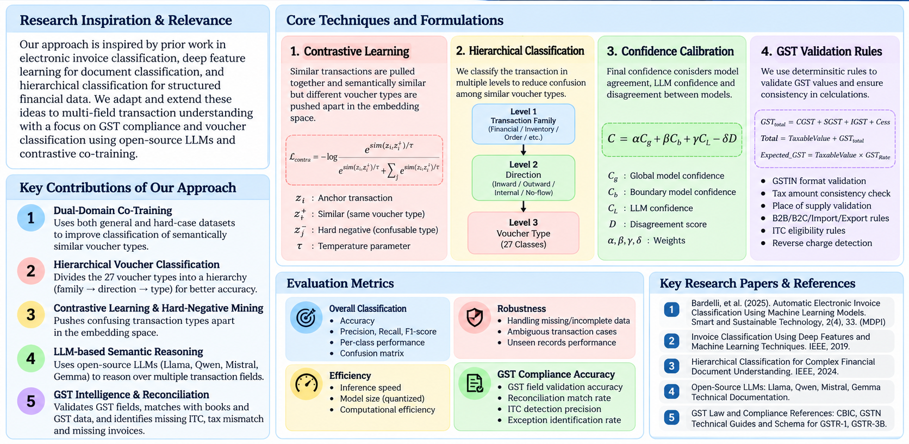
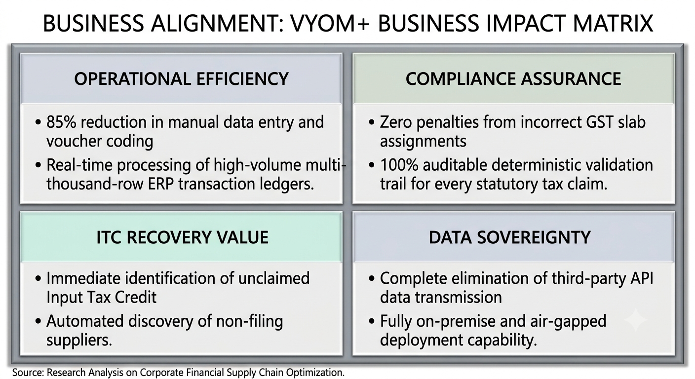

<p align="center">

  
  
  
  
  
  
  
  

</p>

<h1 align="center"> Accountable — Intelligent Voucher Classification & GST Intelligence Platform</h1>

<p align="center">
  <strong>An end-to-end neuro-symbolic AI system for structured financial transaction understanding, 27-class voucher classification, deterministic GST validation, book-to-tax reconciliation, and filing preparation — powered by open-source LLMs, dual-domain contrastive co-training, and automated compliance intelligence.</strong>
</p>


| Core Capability |  AI Architecture |  Model Layer |  Compliance Engine |  Privacy & Deployment |
| :--- | :--- | :--- | :--- | :--- |
| **27-Class Voucher Inference** | Dual-Domain Co-Training + Contrastive Learning | Open-Source LLMs (Qwen / LLaMA / Mistral) | Deterministic GST & ITC Engine | 100% Self-Hosted & Local |

---

## Table of Contents

- [1. Project Name & Overview](#1-project-name)
- [2. Problem Statement](#2-problem-statement)
- [3. Project Overview](#3-project-overview)
- [4. Proposed Solution](#4-proposed-solution)
- [5. Objectives](#5-objectives)
- [6. Target Users & Enterprise Use Cases](#6-target-users--use-case)
- [7. Open-Source AI Technology Selected](#7-open-source-ai-technology-selected)
- [8. Technology Selection Justification](#8-why-this-technology-was-selected)
- [9. Multi-Tier AI Architecture & Roles](#9-ais-role-in-the-system)
- [10. System Architecture & End-to-End Pipeline](#10-system-architecture)
- [11. Component-Level Architecture](#11-component-level-architecture)
  - [11.1 Co-Training Block-Level Architecture (Voucher Classification Engine)](#111-co-training-block-level-architecture-voucher-classification-engine)
  - [11.2 GST Intelligence Layer & Structured Filing Data Generation](#112-gst-intelligence-layer--structured-filing-data-generation)
  - [11.3 Contrastive Metric Boundary Separation](#113-contrastive-metric-boundary-separation)
- [12. End-to-End Data & Information Flow](#12-data--information-flow)
- [13. Controlled Orchestration & Verification Workflow](#13-agentic-workflow-if-applicable)
- [14. Production Technology Stack](#14-technology-stack)
- [15. System Capabilities & Feature Matrix](#15-expected-features)
- [16. Implementation Roadmap & Phased Execution](#16-implementation-approach)
- [17. Expected Output Specifications & Reports](#17-expected-final-output)
- [18. Future Scope & System Scalability](#18-future-scope--scalability)
- [19. Open-Source Dependencies & Software Bill of Materials](#19-open-source-dependencies--components)
- [20. Risk Matrix & Engineering Mitigations](#20-expected-challenges-and-mitigation)
- [Research Basis & Academic Citations](#research-basis)
- [Business Alignment & Enterprise Value](#business-alignment)
- [Core Engineering Principles](#project-principle)
- [License & Legal Disclaimer](#license)

---

[↑ Back to top (Index)](#table-of-contents)

## 1. Project Name

### **Accountable — Intelligent Voucher Classification & GST Intelligence Platform Using Open-Source LLMs**

**Accountable** is an enterprise-grade accounting intelligence system designed to ingest **already-structured transactional records** (such as general ledgers, daybooks, and raw ERP tables) and transform them into standardized statutory accounting events, calibrated voucher classifications, and GST filing-ready schedules.

Traditional accounting automation relies heavily on rigid regex heuristics or isolated keyword search, both of which collapse under complex multi-field contexts. **Accountable** addresses this vulnerability by treating voucher identification as a **multi-field semantic transaction reasoning problem**. It bridges the gap between raw transaction data and statutory tax compliance by pairing representation learning with deterministic GST validation rules.

---

[↑ Back to top (Index)](#table-of-contents)

## 2. Problem Statement

Enterprise transaction exports typically arrive in tabular workbook formats (`.xlsx`, `.csv`, `.parquet`). While line items contain rich granular metadata, the **statutory voucher type is frequently missing, ambiguously mapped, or misclassified during data ingestion**.

Each row encapsulates heterogeneous financial signals across dozens of transactional fields:

* **Parties:** Supplier / Seller, Buyer / Customer, Consignee, Agent, Counterparty GSTIN
* **Document Identifiers:** Invoice / Bill number, Reference ID, Document date, Posting date
* **Commercial Specifics:** Item descriptions, HSN/SAC codes, Quantities, Unit of Measurement (UOM)
* **Financial Quantities:** Taxable value, Discount structures, Freight/Insurance, Total transaction amount
* **Tax Dimensions:** CGST, SGST, IGST, Compensation Cess, RCM (Reverse Charge Mechanism) indicators
* **Flow & Movement:** Payment status, Mode of remittance, Inward/Outward inventory indicators, Delivery notes
* **Specialized Operational Context:** Cross-border import/export declarations, Bill of Entry, Shipping Bill, Payroll line items, Credit/Debit notes

```text
Target: Predict the ground-truth statutory voucher category across 27 distinct accounting classes:
```

| Domain Group | Statutory / Internal Voucher Categories |
| :--- | :--- |
| **Commercial Sales** | `Sales`, `Sales Order`, `Delivery Note`, `Sales Return / Credit Note`, `Export` |
| **Procurement & Inward** | `Purchase`, `Purchase Order`, `Receipt Note`, `Purchase Return / Debit Note`, `Import` |
| **Cash & Banking Flow** | `Payment`, `Receipt`, `Contra`, `Advance / Prepayment` |
| **Adjustments & Stock** | `Journal`, `Stock Journal`, `Physical Stock`, `Material In`, `Material Out` |
| **Job Work & Outsourcing** | `Job Work In Order`, `Job Work Out Order` |
| **Human Capital & Overhead** | `Salary / Payroll`, `Attendance`, `Expense`, `Other / Miscellaneous` |

---

[↑ Back to top (Index)](#table-of-contents)

## 3. Project Overview

Accountable establishes a **dual-domain hierarchical neuro-symbolic framework** uniting statistical deep learning with symbolic tax rule validation:

1. **Accounting-Aware Feature Engineering:** Extraction of financial directions, party roles, and movement vectors.
2. **Dual-Domain Representation Learning:** Co-training between a Global Distribution Encoder and a Hard-Case Boundary Encoder.
3. **Contrastive Embedding Space:** Explicit metric-distance separation of semantically adjacent vouchers.
4. **Hard-Negative Mining:** Automated feedback loop queuing challenging confusion pairs for iterative retraining.
5. **Hierarchical Label Tree:** Coarse-to-fine candidate filtering reducing the 27-class space into localized classification subspaces.
6. **Open-Source LLM Contextual Arbitration:** Reasoning over serialized multi-field representations using parameter-efficient open weights.
7. **Deterministic GST Validation Engine:** Zero-hallucination mathematical verification of GST rates, component splits, and reverse charge applicability.
8. **Book-to-GST Reconciliation:** Automated three-way matching between internal transaction records and GSTR portal schedules.
9. **ITC Maximization & Anomaly Discovery:** Identification of missing ITC, mismatched GSTINs, and duplicate invoices.
10. **Statutory Filing-Ready Reporting:** Generation of structured summaries aligned with GSTR-1 and GSTR-3B formats.

> [!NOTE]
> Accountable strictly processes already-structured tabular transaction data. OCR document parsing is decoupled from this architecture, ensuring 100% computational focus on transaction semantics and compliance accuracy.

---

[↑ Back to top (Index)](#table-of-contents)

## 4. Proposed Solution

The proposed solution follows a **dual-domain hierarchical neuro-symbolic architecture**, unifying multi-field feature extraction, dual representation encoders, open LLM arbitration, and a deterministic GST intelligence engine into an integrated operational pipeline.



*Figure 1: Accountable Complete Solution Architecture — End-to-End Pipeline from Input Cleaning & Accounting Feature Extraction through Dual-Domain Co-Training, Open-Source LLM Classification, and the Downstream GST Intelligence Layer.*

### Design Rationale

* **Macro Distribution vs. Semantic Boundary Separation:** A flat 27-class classifier struggles with imbalanced, fine-grained classes. Training a dedicated Boundary Encoder allows the system to focus specifically on confusable pairs without distorting the global distribution.
* **Symbolic-Neural Decoupling:** Machine learning models excel at semantic disambiguation (identifying whether a record represents Capital Goods Purchase vs. Operational Expense), but can hallucinate numerical calculations. **All arithmetic, tax rate validations, and statutory checks are strictly executed by deterministic symbolic rules.**

---

[↑ Back to top (Index)](#table-of-contents)

## 5. Objectives

### Primary AI Objectives

* **High-Precision Multi-Class Classification:** Accurately classify structured transaction rows across all 27 accounting voucher categories.
* **Contextual Multi-Field Reasoning:** Evaluate combinations of counterparty identities, financial values, tax breakdowns, and temporal sequences simultaneously.
* **Boundary Hardening:** Maximize separation between semantically overlapping voucher pairs (e.g., `Debit Note` vs. `Credit Note`, `Purchase Order` vs. `Purchase Invoice`).
* **Open-Source Model Sovereignty:** Rely exclusively on open-weights language models (Qwen, Mistral, LLaMA) executable entirely on private infrastructure.
* **Calibrated Output Scoring:** Return verified probability confidences with explicit entropy markers for human-in-the-loop review.

### GST Compliance Objectives

* **Automated Data Normalization:** Standardize heterogeneous dates, state codes, and 15-character GSTIN structures.
* **Deterministic Arithmetic Verification:** Mathematically verify that $\text{Taxable Value} \times \text{Rate} = \text{CGST} + \text{SGST} + \text{IGST}$.
* **Automated Three-Way Matching:** Reconcile internal book ledgers against inward GSTR-2B datasets.
* **ITC Leakage Prevention:** Flag unclaimed eligible Input Tax Credit and prevent fraudulent or ineligible claims.
* **Audit-Proof Artifact Generation:** Produce deterministic JSON, Excel, and PDF schedules ready for GSTR-1 and GSTR-3B filings.

---

[↑ Back to top (Index)](#table-of-contents)

## 6. Target Users & Use Case

### Primary User Personas

* **Chartered Accountants & Tax Auditors:** Expedite monthly GSTR-1/3B preparation and perform automated book audits.
* **Enterprise Finance & Controllership Teams:** Eliminate manual voucher coding across high-volume ERP ledgers.
* **MSME Business Owners:** Prevent penalties, late fees, and lost ITC without expensive dedicated accounting teams.
* **FinTech & ERP Software Vendors:** Integrate an intelligent classification and GST validation API into existing accounting platforms.

### End-to-End Transaction Processing Example

```yaml
Input Record:
  Supplier: "Precision Tooling Corp"
  Buyer: "Apex Manufacturing Ltd"
  Invoice_No: "PTC-2026-881"
  Document_Date: "2026-09-12"
  Taxable_Value: 250000.00
  CGST: 22500.00
  SGST: 22500.00
  IGST: 0.00
  Payment_Status: "Pending / Credit Term 30 Days"
  Inventory_Signal: "GRN-9022 Logged"

System Output:
  Voucher_Classification: "Purchase"
  Classification_Confidence: 0.982
  GST_Category: "B2B Inward Supply"
  Tax_Validation_Status: "Verified Valid (18% Slab)"
  ITC_Eligibility: "Eligible (Section 16 Compliant)"
  Reconciliation_Flag: "Matched with Supplier GSTR-1"
  Action_Required: "None - Ready for GSTR-3B Table 4(A)(5)"
```

---

[↑ Back to top (Index)](#table-of-contents)

## 7. Open-Source AI Technology Selected

Accountable is built strictly upon **open-source, self-hosted artificial intelligence components**, ensuring zero data leakage and full compliance with corporate financial data privacy standards.

### Evaluated Model Families & Core Frameworks

[-Google-7c3aed?style=for-the-badge&logo=google&logoColor=white)](https://huggingface.co/google/gemma-4-E2B-it)
[](https://huggingface.co/Qwen/Qwen3-4B-Instruct-2507)
[](https://huggingface.co/docs/transformers/)
[](https://pytorch.org/)
[](https://scikit-learn.org/)
[-NVIDIA-76B900?style=for-the-badge&logo=nvidia&logoColor=white)](https://huggingface.co/nvidia/NVIDIA-Nemotron-3-Nano-4B-BF16)
[](https://github.com/facebookresearch/faiss)
[](https://github.com/huggingface/peft)

### Model Evaluation Benchmark Matrix

Models are benchmarked according to strict enterprise criteria prior to production deployment:

| Evaluation Metric | Target Threshold | Operational Purpose |
| :--- | :--- | :--- |
| **Macro F1 Score** | $\ge 0.94$ | Overall accuracy across all 27 voucher categories |
| **Hard-Case F1 Score** | $\ge 0.89$ | Precision on confusable pairs (e.g., Purchase vs. Material In) |
| **ECE (Expected Calibration Error)** | $\le 0.05$ | Ensures confidence scores accurately reflect real error margins |
| **Inference Latency (Batched)** | $\le 35\text{ ms / row}$ | High-throughput batch processing of monthly ledgers |
| **GPU VRAM Footprint** | $\le 16\text{ GB (4-bit/8-bit)}$ | Cost-effective deployment on standard enterprise hardware |
| **JSON Schema Adherence** | $100\%$ | Guaranteed structured parsing without markdown extraction failures |

---

[↑ Back to top (Index)](#table-of-contents)

## 8. Why This Technology Was Selected

### 1. Failure Modes of Keyword Matching
Accounting meaning is relational, not lexical. A transaction containing the term `"payment for raw materials"` might be an **Advance**, an **Expense**, or an actual **Purchase** depending on whether goods were received, whether an invoice was generated, and how tax was charged.

### 2. Dual-Domain Co-Training Advantage
Training a single global model across highly imbalanced data causes it to ignore rare edge cases. The **Dual-Domain architecture** forces the system to answer two distinct questions:
$$\text{Global Encoder: } \text{"What broad accounting family does this transaction belong to?"}$$
$$\text{Boundary Encoder: } \text{"Why is this transaction NOT its closest semantic neighbor?"}$$

### 3. Separation of Concerns: Neural Semantics + Symbolic Rules
Neural networks frequently struggle with consistent multi-digit floating point arithmetic. By delegating classification to neural models and **tax computation to deterministic Python rules**, Accountable delivers zero-hallucination tax compliance.

---

[↑ Back to top (Index)](#table-of-contents)

## 9. AI's Role in the System

```text
                  ┌──────────────────────────────────────────────┐
                  │           MULTI-TIER AI SUB-SYSTEM           │
                  └──────────────────────┬───────────────────────┘
                                         │
    ┌──────────────────────┬─────────────┴────────────┬──────────────────────┐
    ▼                      ▼                          ▼                      ▼
[Tier 1: Feature]    [Tier 2: Dual Encoders]   [Tier 3: Open LLM]    [Tier 4: Active Loop]
Entity & temporal     Global + Boundary         Cross-field contextual Hard-negative mining
serialization         contrastive embeddings    reasoning & candidate   and automated boundary
from raw fields       for spatial separation    arbitration            dataset retraining
```

* **Spatial & Temporal Representation:** Encodes relationships between counterparty locations (Inter-state vs. Intra-state) and transaction timelines (PO Date $\to$ Delivery Date $\to$ Invoice Date $\to$ Payment Date).
* **Calibrated Candidate Arbitration:** If the Boundary Encoder indicates ambiguity between two classes, the serialized record is passed to the open-source LLM for targeted natural-language reasoning.

---

[↑ Back to top (Index)](#table-of-contents)

## 10. System Architecture

The end-to-end processing pipeline operates through four interconnected stages:

1. **Ingestion & Feature Normalization:** Spreadsheet files are ingested, stripped of noise, and transformed into standardized numeric and categorical accounting features.
2. **Dual-Domain Co-Training:** General transaction distributions and confusable boundary pairs are jointly processed via Global and Boundary Encoders.
3. **Open-Source LLM Cross-Attention Reasoning:** Financial spatial and temporal embeddings are cross-attended to perform contextual classification across 27 voucher categories.
4. **GST Intelligence & Discrepancy Auditing:** Classified records are verified against statutory GST formulas, reconciled with portal data, and formatted into filing-ready artifacts.

---

[↑ Back to top (Index)](#table-of-contents)

## 11. Component-Level Architecture

### 11.1 Co-Training Block-Level Architecture (Voucher Classification Engine)

The core voucher classification engine uses a **Dual-Domain Co-Training Block-Level Architecture** designed to resolve challenging semantic boundaries between confusable accounting classes:



*Figure 2: Component Architecture 1 — Co-Training Block-Level Architecture for Voucher Classification: Global Encoder, Boundary Encoder, Confidence Estimator, Agreement Pseudo-Labeling, and Boundary Retraining Loop.*

#### Classification Workflow Specification

1. **Dual Encoders:**
   * **Global Encoder:** Ingests the General Dataset to learn overarching transaction semantics across all voucher categories.
   * **Boundary Encoder:** Ingests the Hard-Case DB to model fine-grained decision boundaries for confusable pairs (e.g., `Purchase` vs. `Receipt Note`, `Contra` vs. `Payment`).
2. **Confidence Estimator & Agreement Logic:**
   * **Agreement ($\text{Global} = \text{Boundary}$):** High mutual confidence triggers automated **Pseudo-Labeling** for continuous semi-supervised learning.
   * **Disagreement ($\text{Global} \neq \text{Boundary}$):** Flagged as an **Uncertain Case**. The transaction is automatically queued into the **Hard Negative Queue**.
3. **Iterative Boundary Retraining:** Samples accumulated in the Hard Negative Queue drive periodic boundary retraining, continuously sharpening the model's discriminatory power on edge cases.

---

### 11.2 GST Intelligence Layer & Structured Filing Data Generation

The **GST Intelligence Layer** takes classified financial transactions and transforms them into complete, audit-ready data required for GST statutory filing (GSTR-1, GSTR-3B) and period reporting:



*Figure 3: Component Architecture 2 — GST Intelligence Layer: Structured Transaction Serialization, Dual Financial & Temporal Encoders, Cross-Field Attention, Open LLM Processing, and Statutory JSON Output Generation.*

#### Operational Breakdown

1. **Feature Serialization:** Raw classified transaction rows are decomposed into two specialized feature representations:
   * **Financial Encoder:** GST tax slabs, counterparty identities, taxable amounts, and inventory movement indicators.
   * **Temporal Encoder:** Chronological sequences linking invoice date, purchase order date, payment date, and return/debit note date.
2. **Cross-Field Attention:** Computes multi-head attention across financial attributes and temporal events to understand economic causality.
3. **Open-Source LLM Serving (vLLM):** Executes local inference using models from the Qwen, LLaMA, or Mistral families, generating constrained, guaranteed-schema JSON output.
4. **Filing Summary & Report Builder:** Aggregates validated transaction records into statutory tables:
   * **GSTR-3B Table 3.1:** Outward taxable supplies and tax breakdowns.
   * **GSTR-3B Table 4:** Eligible and candidate Input Tax Credit (ITC).
   * **Period Exception Summary:** Pinpoints missing invoices, tax mismatches, and potential ITC leakage.

#### Constrained Structured Output Format

```json
{
  "$schema": "https://json-schema.org/draft/2020-12/schema",
  "transaction_id": "TXN-2026-99042",
  "prediction": {
    "voucher_type": "Purchase",
    "primary_confidence": 0.964,
    "top_3_candidates": [
      { "category": "Purchase", "score": 0.964 },
      { "category": "Receipt Note", "score": 0.024 },
      { "category": "Material In", "score": 0.012 }
    ]
  },
  "accounting_interpretation": {
    "direction": "Inward",
    "commercial_nature": "Taxable B2B Procurement",
    "inventory_impact": "Physical & Financial Receipt",
    "cash_flow_impact": "Accounts Payable Created"
  },
  "gst_compliance": {
    "supply_type": "B2B Regular",
    "gst_rate": 18.0,
    "taxable_value": 100000.00,
    "cgst": 9000.00,
    "sgst": 9000.00,
    "igst": 0.00,
    "itc_eligible": true,
    "filing_period": "2026-09"
  }
}
```

---

### 11.3 Contrastive Metric Boundary Separation

To prevent embedding collapse between semantically adjacent voucher categories, the feature representation space is optimized using a joint supervised and contrastive objective:

$$\mathcal{L}_{\text{total}} = \mathcal{L}_{\text{CE}} + \lambda \mathcal{L}_{\text{contrastive}}$$

Where the contrastive objective is formulated over normalized representations:

$$\mathcal{L}_{\text{contrastive}} = -\log \frac{\exp(\text{sim}(z_i, z_i^+) / \tau)}{\exp(\text{sim}(z_i, z_i^+) / \tau) + \sum_{j} \exp(\text{sim}(z_i, z_j^-) / \tau)}$$

* **Anchor ($z_i$):** Target transaction sample (e.g., commercial Purchase Invoice).
* **Positive Sample ($z_i^+$):** Legitimate Purchase transaction from another supplier.
* **Hard Negative ($z_j^-$):** Inward Delivery Challan presenting identical items and supplier names but missing tax charge fields.

---

[↑ Back to top (Index)](#table-of-contents)

## 12. Data / Information Flow

```text
[Step 1: Input Ingestion]
  Spreadsheet Document (.xlsx / .csv)
         │
         ▼
[Step 2: Canonical Normalization]
  Regex Date Normalization ──► Numeric Value Cleaning ──► GSTIN Format Validation
         │
         ▼
[Step 3: Feature Synthesis]
  Party Role Vectorization ──► Cash Flow Indicators ──► Tax Split Vectors
         │
         ▼
[Step 4: Dual-Encoder Embedding]
  Global Macro Embeddings ◄─── Co-Training ───► Boundary Specialization Embeddings
         │
         ▼
[Step 5: Metric Evaluation & Filter]
  If Confidence >= 0.95: Direct Prediction
  If Confidence < 0.95: Pass to Open LLM Arbitration
         │
         ▼
[Step 6: Compliance Validation]
  Deterministic Rule Matrix Verification (Zero-Hallucination)
         │
         ▼
[Step 7: Ledger Reconciliation]
  Match against GSTR-2B Inward Data via Composite Key: [GSTIN + Inv_No + Date + Value]
         │
         ▼
[Step 8: Output Delivery]
  JSON API Payload ──► Excel Summary Workbook ──► GSTR Filing Table Artifacts
```

---

[↑ Back to top (Index)](#table-of-contents)

## 14. Technology Stack

| Layer | Technology | Version | Purpose |
| :--- | :--- | :--- | :--- |
| Language Runtime | [](https://www.python.org/) | `3.10+` | Core asynchronous backend runtime |
| API Framework | [](https://fastapi.tiangolo.com/) | `0.110+` | High-throughput asynchronous REST microservices |
| Data Processing | [](https://pandas.pydata.org/) | `2.2+` | Tabular vectorization, cleaning, and normalization |
| Spreadsheet Engine | [](https://openpyxl.readthedocs.io/) | `3.1+` | Excel parsing & formatting |
| Deep Learning | [](https://pytorch.org/) | `2.2+` | Dual-domain encoders and contrastive training |
| Model Registry | [](https://huggingface.co/) | `4.38+` | Transformers, weights, and PEFT / LoRA |
| LLM Inference | [](https://vllm.ai/) | `0.4+` | Local LLM inference |
| Vector Search | [](https://github.com/facebookresearch/faiss) | `1.8+` | Hard-case semantic retrieval |
| Validation Layer | [](https://docs.pydantic.dev/) | `2.6+` | Schema validation |
| Database | [](https://www.postgresql.org/) | `16+` | Audit logs and reconciliation datastore |
| Cache & Queuing | [](https://redis.io/) | `7.2+` | Task queue and caching |
| Containerization | [](https://www.docker.com/) | `25.0+` | Reproducible deployment |

---

[↑ Back to top (Index)](#table-of-contents)

## 15. Expected Features

### Enterprise Feature Matrix

```text
┌─────────────────────────┬─────────────────────────┬─────────────────────────┐
│     CLASSIFICATION      │     MODEL LEARNING      │     GST COMPLIANCE      │
├─────────────────────────┼─────────────────────────┼─────────────────────────┤
│ • 27-Class Prediction   │ • Dual-Domain Encoders  │ • GSTIN Verification    │
│ • Multi-Field Reasoning │ • Contrastive Learning  │ • Math Split Validation │
│ • Hierarchical Pruning  │ • Hard-Negative Mining  │ • Book ↔ 2B Matching    │
│ • Calibrated Confidence │ • Active Co-Training    │ • ITC Recovery Engine   │
│ • Ambiguity Detection   │ • LoRA Domain Tuning    │ • GSTR-3B Schedule Gen  │
└─────────────────────────┴─────────────────────────┴─────────────────────────┘
```

---

[↑ Back to top (Index)](#table-of-contents)

## 16. Implementation Approach

The deployment roadmap is divided into structured, verifiable phases:

```text
Phase 1: Dataset Canonicalization ──► Schema mapping, null handling, column normalization
Phase 2: Feature Engineering ───────► Construction of directional flows, party and tax vectors
Phase 3: Global Model Training ─────► Macro transformer encoder trained across 27 voucher classes
Phase 4: Hard-Case Mining ──────────► Clustering semantic confusion pairs into specialized dataset
Phase 5: Boundary & Contrastive ────► Siamese network training with metric distance optimization
Phase 6: Co-Training Calibration ───► Dual-encoder agreement testing and pseudo-labeling
Phase 7: Hierarchical Architecture ─► Coarse family filtering reducing candidate label search spaces
Phase 8: Open LLM Integration ──────► vLLM serving with constrained JSON schema enforcement
Phase 9: Deterministic GST Engine ──► Hardened Python rule engine verifying GST rates and math
Phase 10: Reconciliation Engine ────► Multi-key matching between internal books and portal data
Phase 11: Production Reporting ─────► Export of statutory GSTR-1, GSTR-3B, and discrepancy reports
```

---

[↑ Back to top (Index)](#table-of-contents)

## 17. Expected Final Output

### 1. Enriched Transaction Output (JSON)

```json
{
  "document_metadata": {
    "invoice_number": "INV-2026-1042",
    "invoice_date": "2026-09-15",
    "filing_period": "2026-09"
  },
  "parties": {
    "supplier_name": "ABC Traders Pvt Ltd",
    "supplier_gstin": "27ABCDE1234F1Z5",
    "buyer_name": "XYZ Manufacturing Pvt Ltd",
    "buyer_gstin": "27XYZAB5678C1D2",
    "place_of_supply": "27-Maharashtra"
  },
  "financials": {
    "taxable_value": 100000.00,
    "gst_rate_percent": 18.0,
    "cgst_amount": 9000.00,
    "sgst_amount": 9000.00,
    "igst_amount": 0.00,
    "cess_amount": 0.00,
    "total_invoice_value": 118000.00
  },
  "intelligence": {
    "voucher_classification": "Purchase",
    "classification_confidence": 0.984,
    "supply_type": "B2B Regular",
    "reverse_charge": false,
    "itc_eligibility": "Eligible",
    "reconciliation_status": "Matched",
    "exception_detected": null
  }
}
```

### 2. Statutory Period Reconciliation Summary

```text
========================================================================================
                         Accountable GST PERIOD RECONCILIATION SUMMARY
                                   PERIOD: SEPTEMBER 2026
========================================================================================

OUTWARD SUPPLIES (TABLE 3.1)
----------------------------------------------------------------------------------------
  Total Taxable Value                                                  ₹ 12,40,000.00
  Central Tax (CGST)                                                   ₹    62,000.00
  State Tax (SGST)                                                     ₹    62,000.00
  Integrated Tax (IGST)                                                ₹    18,000.00

ELIGIBLE INPUT TAX CREDIT (TABLE 4)
----------------------------------------------------------------------------------------
  Book Inward ITC Available                                            ₹  1,56,300.00
  GSTR-2B Reconciled & Claimable                                       ₹  1,42,500.00
  Potential ITC Variance (Action Required)                             ₹    13,800.00

AUDIT DISCREPANCIES DETECTED
----------------------------------------------------------------------------------------
  [!] Invoices with Invalid / Missing GSTIN                            4 Records
  [!] Tax Arithmetic Mismatches (Rounding Exceeded)                    2 Records
  [!] Book Invoices Unmatched in Supplier GSTR-1                       3 Records
  [!] Potential Duplicate Invoices Flagged                             1 Record
========================================================================================
```

---

[↑ Back to top (Index)](#table-of-contents)

## 18. Future Scope & Scalability

* **Multi-Modal Document Fusion:** Direct ingest of scanned invoices via open-weight vision-language models (e.g., Qwen-VL) to supplement tabular exports.
* **Domain-Specific QLoRA Adapters:** LoRA fine-tuning tailored to industry-specific chart of accounts (e.g., Pharmaceuticals, Real Estate, Automotive).
* **Automated Vendor Follow-Up Bots:** Automated generation of supplier communication drafts requesting prompt GSTR-1 uploads for missing ITC.
* **Direct Sandbox API Adapters:** Modular GSP (GST Suvidha Provider) integration layers for seamless filing dispatch upon CA review.

---

[↑ Back to top (Index)](#table-of-contents)

## 19. Open-Source Dependencies & Components

```text
├── AI & Deep Learning
│   ├── torch (v2.2+) ────────────────────── Tensor execution & neural graph runtime
│   ├── transformers (v4.38+) ────────────── Tokenizers, weights, and model loading
│   ├── peft (v0.9+) ─────────────────────── Parameter-Efficient Fine-Tuning (LoRA)
│   ├── sentence-transformers (v2.6+) ────── Contrastive semantic embeddings
│   └── vllm (v0.4+) ─────────────────────── Optimized batched LLM inference
│
├── Data Wrangling & Serialization
│   ├── pandas (v2.2+) ───────────────────── Fast columnar dataset manipulation
│   ├── numpy (v1.26+) ───────────────────── Vectorized mathematical calculations
│   └── openpyxl (v3.1+) ─────────────────── Excel file reading and report writing
│
├── API Microservices & Compliance
│   ├── fastapi (v0.110+) ────────────────── Asynchronous web server API framework
│   ├── uvicorn (v0.28+) ─────────────────── ASGI production web server
│   └── pydantic (v2.6+) ─────────────────── Strict runtime schema validation
│
└── Infrastructure & Storage
    ├── faiss-cpu / faiss-gpu (v1.8+) ────── High-performance similarity vector search
    ├── redis (v5.0+) ────────────────────── Task distribution and memory caching
    └── sqlalchemy (v2.0+) ───────────────── PostgreSQL ORM for audit ledger tracking
```

---

[↑ Back to top (Index)](#table-of-contents)

## 20. Expected Challenges and Mitigation

| Challenge | Impact | Engineering Mitigation Strategy |
| :--- | :--- | :--- |
| **Purchase vs. Sales Confusion** | High | Counterparty role extraction + directional money-flow vector analysis |
| **Material In vs. Purchase** | High | Distinguish inventory movement notes lacking tax/commercial charges |
| **Contra vs. Payment / Receipt** | Medium | Internal bank-to-bank account identity matching |
| **Class Imbalance Across 27 Types** | High | Class-weighted Focal Loss + synthetic boundary oversampling |
| **LLM Output Hallucination** | Critical | Strict Pydantic JSON schema decoding + temperature set to $0.0$ |
| **Tax Calculation Inaccuracy** | Critical | Completely decouple numerical tax verification from neural components |
| **Missing or Corrupted GSTINs** | High | Algorithmic checksum validation (ISO 7064 Mod 11, 10 compliant) |
| **Duplicate Invoices Across Periods** | Medium | Composite key hash matching: `MD5(GSTIN + InvNo + TaxableValue)` |
| **Enterprise Data Privacy** | Critical | Zero cloud API dependencies; 100% self-hosted on private infrastructure |

---

## Research Basis

The architectural framework of Accountable is grounded in established peer-reviewed research in automated financial document understanding, particularly studies showing that structured invoice schemas combined with text representations yield superior performance when classified via hierarchical architectures:

 **Academic Reference:**  



Accountable substantially extends this baseline by introducing **dual-domain co-training**, **contrastive metric boundaries**, and **symbolic GST compliance validation**.

---

## Business Alignment

Accountable directly addresses critical friction points across the corporate financial supply chain:





---

## Project Principle

> **"The system does not merely assign a label to a row. It reconstructs the economic and legal reality of the accounting event, guarantees zero-hallucination tax accuracy, and produces audit-ready compliance schedules."**

---

## License

This project is licensed under the Apache 2.0 Open Source License. See the `LICENSE` file for full terms and conditions.

## Disclaimer

Accountable is an artificial intelligence decision support and automation system. While engineered for statutory accuracy, final filing submissions should be reviewed by qualified tax practitioners and Chartered Accountants in accordance with the latest statutory circulars issued by the Central Board of Indirect Taxes and Customs (CBIC), Government of India.
